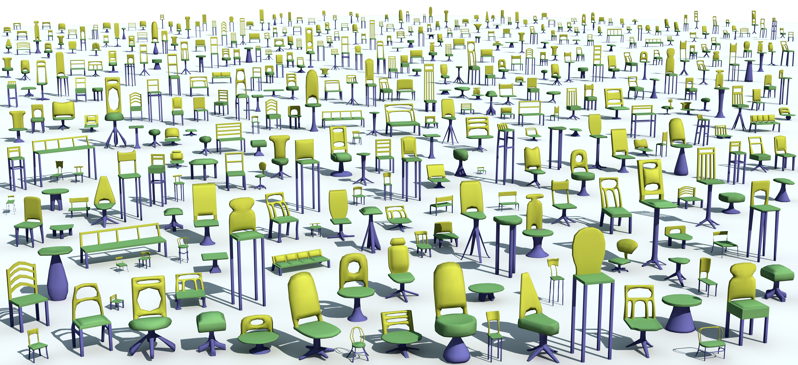

# The Shape COSEG Dataset

## News

December 8, 2012: we fixed several problems in the ground-truth of our modeled irons, tele-aliens, and chairs.

## Overview

The goal of this work is to provide data for quantitative analysis of how people consistently segment a set of shapes and for evaluation of our [active co-analysis algorithm](http://www.yunhaiwang.net/public_html/ssl/ssl.htm). To build the dataset, we have collected 11 sets of shapes which possess a consistent ground-truth segmentation and labeling. Among them, seven sets from the dataset of [Sidi et al. [2011]](http://www.cs.sfu.ca/~ovankaic/personal/cosegmentation/). Since we consider the labeling of large sets as one of the main motivations of our work, we created three additional large sets: [tele-alines](http://www.yunhaiwang.net/public_html/ssl/data/Tele-aliens/image.jpg), [vases](http://www.yunhaiwang.net/public_html/ssl/data/Tele-aliens/image.jpg) and [chairs](http://www.yunhaiwang.net/public_html/ssl/data/Tele-aliens/image.jpg). These three sets consists of 200, 300, 400 shapes, respetively. We also created a small but challenging set of [irons](http://www.yunhaiwang.net/public_html/ssl/data/Irons/image.jpg).

## Downloads

All data can be downloaded for free via the following links.

8 small sets.

<table width="70%" border="2">
  <tbody>
    <tr>
      <td width="29%" align="center">Candelabra</td>
      <td width="27%" align="center">
        <a href="http://www.yunhaiwang.net/public_html/ssl/data/Candelabra/shapes.zip" target="_blank"
          >28 Shapes</a
        >
      </td>
      <td width="29%" align="center">
        <a href="http://www.yunhaiwang.net/public_html/ssl/data/Candelabra/gt.zip" target="_blank"
          >Ground-truth</a
        >
      </td>
      <td width="15%" align="center">
        
      </td>
    </tr>
    <tr>
      <td align="center">Chairs</td>
      <td align="center">
        <a href="http://www.yunhaiwang.net/public_html/ssl/data/Chair/shapes.zip" target="_blank">20 Shapes</a>
      </td>
      <td align="center">
        <a href="http://www.yunhaiwang.net/public_html/ssl/data/Chair/gt.zip" target="_blank">Ground-truth</a>
      </td>
      <td align="center">
        
      </td>
    </tr>
    <tr>
      <td align="center">Fourleg</td>
      <td align="center">
        <a href="http://www.yunhaiwang.net/public_html/ssl/data/Four-legged/shapes.zip" target="_blank"
          >20 Shapes</a
        >
      </td>
      <td align="center">
        <a href="http://www.yunhaiwang.net/public_html/ssl/data/Four-legged/gt.zip" target="_blank"
          >Ground-truth</a
        >
      </td>
      <td align="center">
        
      </td>
    </tr>
    <tr>
      <td align="center">Goblets</td>
      <td align="center">
        <a href="http://www.yunhaiwang.net/public_html/ssl/data/Goblets/shapes.zip" target="_blank"
          >12 Shapes</a
        >
      </td>
      <td align="center">
        <a href="http://www.yunhaiwang.net/public_html/ssl/data/Goblets//gt.zip" target="_blank"
          >Ground-truth</a
        >
      </td>
      <td align="center">
        
      </td>
    </tr>
    <tr>
      <td align="center">Guitars</td>
      <td align="center">
        <a href="http://www.yunhaiwang.net/public_html/ssl/data/Guitars/shapes.zip" target="_blank"
          >44 Shapes</a
        >
      </td>
      <td align="center">
        <a href="http://www.yunhaiwang.net/public_html/ssl/data/Guitars/gt.zip" target="_blank">Ground-truth</a>
      </td>
      <td align="center">
        
      </td>
    </tr>
    <tr>
      <td align="center">Lamps</td>
      <td align="center">
        <a href="http://www.yunhaiwang.net/public_html/ssl/data/Lampes/shapes.zip" target="_blank">20 Shapes</a>
      </td>
      <td align="center">
        <a href="http://www.yunhaiwang.net/public_html/ssl/data/Lampes/gt.zip" target="_blank">Ground-truth</a>
      </td>
      <td align="center">
        
      </td>
    </tr>
    <tr>
      <td align="center">Vases</td>
      <td align="center">
        <a href="http://www.yunhaiwang.net/public_html/ssl/data/Vases/shapes.zip" target="_blank"> 28 Shapes</a>
      </td>
      <td align="center">
        <a href="http://www.yunhaiwang.net/public_html/ssl/data/Vases/gt.zip" target="_blank">Ground-truth</a>
      </td>
      <td align="center">
        
      </td>
    </tr>
    <tr>
      <td align="center">Irons</td>
      <td align="center">
        <a href="http://www.yunhaiwang.net/public_html/ssl/data/Irons/shapes.zip" target="_blank">18 Shapes</a>
      </td>
      <td align="center">
        <a href="http://www.yunhaiwang.net/public_html/ssl/data/Irons/gt.zip" target="_blank">Ground-truth</a>
      </td>
      <td align="center">
        
      </td>
    </tr>
  </tbody>
</table>

3 large sets.

<table width="70%" border="2">
  <tbody>
    <tr>
      <td width="29%" align="center">Tele-aliens</td>
      <td width="27%" align="center">
        <a href="http://www.yunhaiwang.net/public_html/ssl/data/Tele-aliens/shapes.zip" target="_blank"
          >200 Shapes</a
        >
      </td>
      <td width="29%" align="center">
        <a href="http://www.yunhaiwang.net/public_html/ssl/data/Tele-aliens/gt.zip" target="_blank"
          >Ground-truth</a
        >
      </td>
      <td width="15%" align="center">
        
      </td>
    </tr>
    <tr>
      <td align="center">Vases</td>
      <td align="center">
        <a href="http://www.yunhaiwang.net/public_html/ssl/data/Large-Vases/shapes.zip" target="_blank"
          >300 Shapes</a
        >
      </td>
      <td align="center">
        <a href="http://www.yunhaiwang.net/public_html/ssl/data/Large-Vases/gt.zip" target="_blank"
          >Ground-truth</a
        >
      </td>
      <td align="center">
        
      </td>
    </tr>
    <tr>
      <td align="center">Chairs</td>
      <td align="center">
        <a href="http://www.yunhaiwang.net/public_html/ssl/data/Large-Chairs/shapes.zip" target="_blank"
          >400 Shapes</a
        >
      </td>
      <td align="center">
        <a href="http://www.yunhaiwang.net/public_html/ssl/data/Large-Chairs/gt.zip" target="_blank"
          >Ground-truth</a
        >
      </td>
      <td align="center">
        
      </td>
    </tr>
  </tbody>
</table>

## Sources

The related projects from which the dataset grew to its current form:

* Yunhai Wang, Shmulik Asafi, Oliver van Kaick, Hao Zhang, Daniel Cohen-Or, Baoquan Chen, [Active Co-Analysis of a Set of Shapes](http://www.yunhaiwang.net/public_html/ssl/ssl.htm), _ACM Transactions on Graphics_ (Proc. SIGGRAPH Asia), vol. 31, n. 6, 2012.
* Oana Sidi, Oliver van Kaick, Yanir Kleiman, Hao Zhang, Daniel Cohen-Or, [Unsupervised Co-Segmentation of a Set of Shapes via Descriptor-Space Spectral Clustering](http://www.cs.sfu.ca/~ovankaic/personal/cosegmentation/), _ACM Transactions on Graphics_ (Proc. SIGGRAPH Asia), vol. 30, n. 6, pp. 126-134, 2011
* Oliver van Kaick, Andrea Tagliasacchi, Oana Sidi, Hao Zhang, Daniel Cohen-Or, Lior Wolf, Ghassan Hamarneh, [Prior Knowledge for Part Correspondence](http://www.cs.sfu.ca/~ovankaic/personal/corr_knowledge/), _Computer Graphics Forum_ (Proc. Eurographics), vol. 30, n. 2, pp. 553-562, 2011.

## Credits

We thank Xiaobai Chen ([Princeton mesh segmenation bechmark](http://segeval.cs.princeton.edu)), Daniela Giorgi and AIM@SHAPE (SHREC 2007 Watertight Track), and Ran Gal for some of the models used in the benchmark. Andrea Tagliasacchi, Oliver van Kaick, Oana Sidi, Yanir Kleiman, Shmulik Asafi, Yunhai Wang and the artists in SIAT: Jiacheng Ren and Guangfan Pan, have contributed to creating the other shapes.

## Links

[Projective shape analysis (PSA) dataset](http://www.yunhaiwang.net/public_html/psa/psad.html)

## Feedback

Please send email to **cloudseawang [at] gmail.com** if you have any questions.

_Last updated: 07/04/2019 00:32:42_